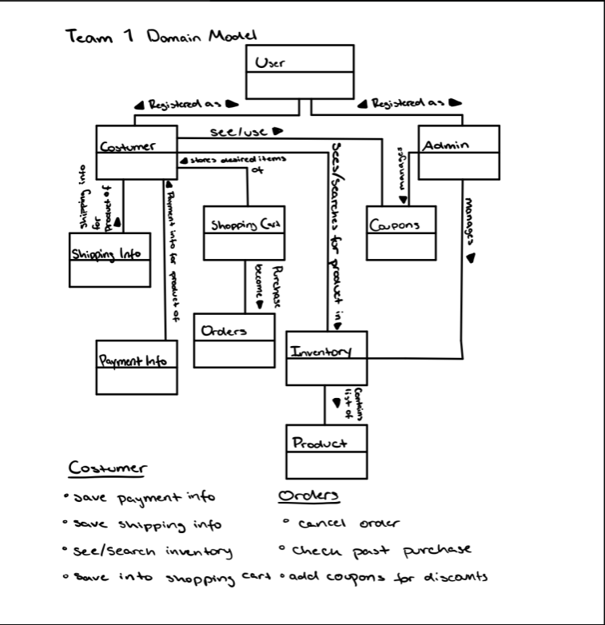
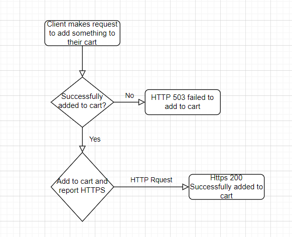
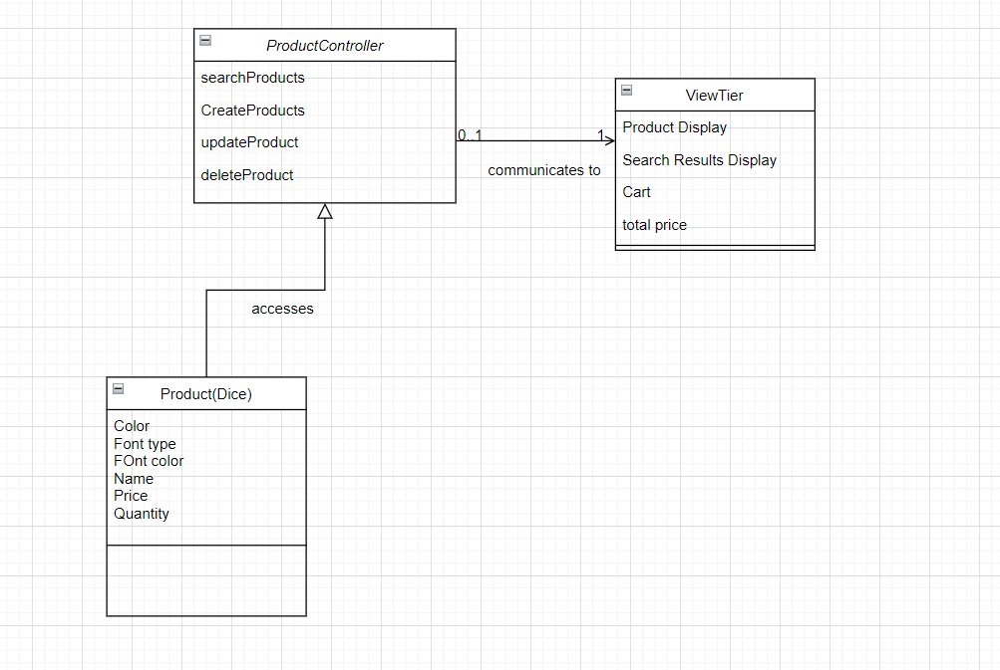
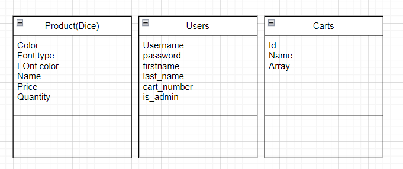
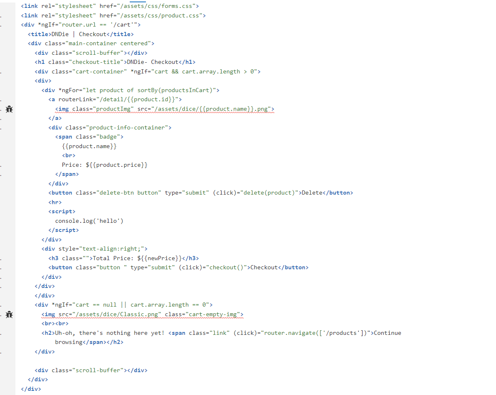
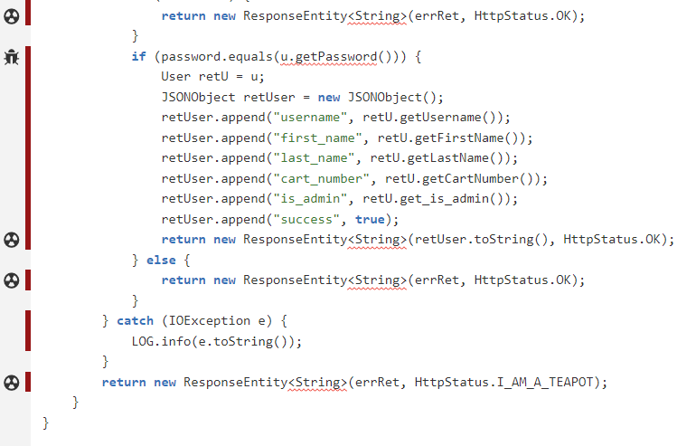

# PROJECT Design Documentation

> _The following template provides the headings for your Design
> Documentation.  As you edit each section make sure you remove these
> commentary 'blockquotes'; the lines that start with a > character
> and appear in the generated PDF in italics._

## Team Information
* Team name: TEAMNAME
* Team members
  * INES VILLEGAS COSTA
  * KAI LOUIE
  * MICHAEL BURKE
  * ALEXANDER JEROME BEEKMAN
  * AIDAN DALGARNO-PLATT

## Executive Summary

DNDie is an online dice store where there are a crazy compination of dice sets, varying colors, fonts, and font color. 

### Purpose

To provide an easy to use interface in order for clients and customers that desire a new dice sets. It also provides store owner(s) an interface to manage the dice products (add, delete, update, etc).

### Glossary and Acronyms

| Term | Definition |
|------|------------|
| DND | Dungeons and Dragons |

## Requirements

This section describes the features of the application.

- Registering/Logging in Users
- Product Interaction
- Product Management
- Checkout Cart
- Coupons

### Definition of MVP

The basics of product management: being able to add, delete, search, sort, and update products. Basic user purchase: being able to view items, save items, and purchase items.

### MVP Features

- Browse Products
- Search Products
- Add Products
- Remove Products
- Sort Products
- Update Products
- Manage Orders
- View Order
- Purchase Product

### Roadmap of Enhancements

- User Interface
- Logging in User
- Browse and Search Products
- View Specific Product

## Application Domain

This section describes the application domain.

Users can register as either a customer or admin, each having its own set of privledges. Costumers store their wanted dice sets in a shopping cart, which will be linked to an order number. They can also store their payment and shipping infor, to make future checkouts faster. Both Users and Admin will be able to search and browse throught the product inventory, and see the individual coupons for each product. Admin will be able to update and manage products to their liking.

## Architecture and Design

This section describes the application architecture.

### Summary

The following Tiers/Layers model shows a high-level view of the webapp's architecture.

The e-store web application, is built using the Model–View–ViewModel (MVVM) architecture pattern. 

The Model stores the application data objects including any functionality to provide persistance. 

The View is the client-side SPA built with Angular utilizing HTML, CSS and TypeScript. The ViewModel provides RESTful APIs to the client (View) as well as any logic required to manipulate the data objects from the Model.

Both the ViewModel and Model are built using Java and Spring Framework. Details of the components within these tiers are supplied below.

### Overview of User Interface

This section describes the web interface flow; this is how the user views and interacts
with the e-store application.

The user will open up to the home page, where they can see a small collection of the total product inventory. There they can either switch pages in order to achieve a variety of things. They can log/register themselves in the store, see the entire product inventory, searh for products, and their shopping cart. When a user interacts with a product, then they shall be transfered into that products page, where they can view that one product, view their coupons, if applicable, and save it into their cart.

### View Tier

The view tier handles a majority of the client side UI elements. When a client utilizes a feature of the site (adding to cart, searching product, etc) The site properly updates depending on what their respective request was. The primary aspects of the view tier would be the add to cart, search products, or the products themselves as they appear to the client. Looking at the Diagram prodivded, the add to cart feature can be explored when a Client makes a request to add something to their cart.

### ViewModel Tier

The view model tier is the "handshake" tier between the front end and the back end elements of the service. The Service and Controller elements of the classes regarding carts, products, and users. When the Client makes a request on the front end, it will carry the request to the back end, and the outcome back as well as any neccesary http requests. A closer look at the critical elements of the Products service and controller elements will serve as a primary example. 

### Model Tier

The model tier is where the majority of the Data exists. The existence of the Products, Users/Login info, Carts, etc is all handled within the Model tier. This can be sonsidered the bottom of the pyramid in terms of the tiers, as it contains all of the Objects and their respective functions. The same UML diagram used for the ViewModel tier can be use to look at the Model tier. 

### Static Code Analysis/Design Improvements

In this project we tried to integrate Single Responsibility principle, by having each class entity (user, cart and product) interact with their own controller, model, and persistence. Even in the front end we tried to utilize the service so that the http requests could be done through a service java file, rather than directly from the component itself. Through these techniques we found to have low coupling between our entities. We incorporated the use of interfaces and abstract classes in order to mediate the requests between entities, in other words using the Diversion Injection principle. The controller also acts as a median between the front-end and back-end. One thing to note is that although we had these principles in mind when developing our code, there were instances where we failed to be consistent with such principles. Since so many people were working on the project, each with their individual styles of coding, there are instances were these principles are not seen, such as not utilizing the files and components that were meant for being the median between the front and back end. There are moments where the component page would directly communicate with the api, therefore violating Diversion Injecition and Single Responsibility. One reccomendation for the future is to be consistent throughout the entire application and to talk before hand which principles we want to focus on, as well as have someone checking each other's code to see if it satisfies such requirements.

Holistically, the static code analysis showed good (although could be better) coverage percentage and had a very small amount of instances with code smells. The API only had 2 bags while the UI however had 9 bugs. Within the UI, the source code that was the primary source of a majority of the bugs was centered around the View secition (HTML files in particlaur) indicating that although the program itself may run correctly, it would have issues with displaying. 

The API was a much smaller source for bug and code smells, indicating that the actual implementation and ground layer of the project ran without much issue. The only bug on the API side is within the Login implentation, and only becomes an error in specific login instances when attempting to retieve a password. An example of this instance is shown below. 

Holistically, a majority of the code was covered with a fairly minimal amount of bugs/code smells. Going forward, attempting to get more coverage in and fix the small bugs that currently exists would be a good start for further improvement. 

## Testing

We assigned on person in the group to test each component once were finished with it. Not only was unit testing 
utilized to test each code segment and function, but we manually played with our website in order to see if
there was anything else we should fix. For example, we discovered that when a user searches for an item and then goes
to home, no products were displayed. This is because search terms were made public, the application would remember the terms and apply it to all pages that were getting products. Another similar example would be when a user switchs from search, home to search, the search input would disapear but the list of products that is filtered would be filtered from the previous search and not reset itself
after switching pages.

### Acceptance Testing

For each of our stories we had around one to two acceptance tests. Usually it would be one test that would check if it passes the
Story definition and the other to test that if the application fails to finish said request it would alert the system. Some stories
would also consist of acceptance tests that alert the application if successful. So far 17 out of the 20 acceptance test have been passed. The 3 acceptance test that are not considered are ones that we have not gotten to yet. These usually include tests that check
if the system alerts if the request has failed or not. Some issues that are of concern is that the application returns what it needs to
but if the user starts messing with the request input, then the system may not be able to handle such errors in an efficient manner.

### Unit Testing and Code Coverage

We had one member in charge of the unit testing. Each time a function was ready to be tested, this memeber would create unit testing for each of the finished functions, later running said tests. We decided to target on three things, depending on the tier these test would vary, successful, failure and handle exception. For each function we developed both a sucess and a fail method in order to test if the functions worked or not. Where as the handle exception are to see if the api correctly identifies the type of error. We believed that this was the best method in order to test all our functions. However, as time passed we soon forgot about unit testing, and by the end we had too many test to make. As a result our code coverage results only coverage 86% of our code, however, we are proud to say that all functions passed their tests. From the experience we learned how important it is to get unit testing done along with the a functions completness.
